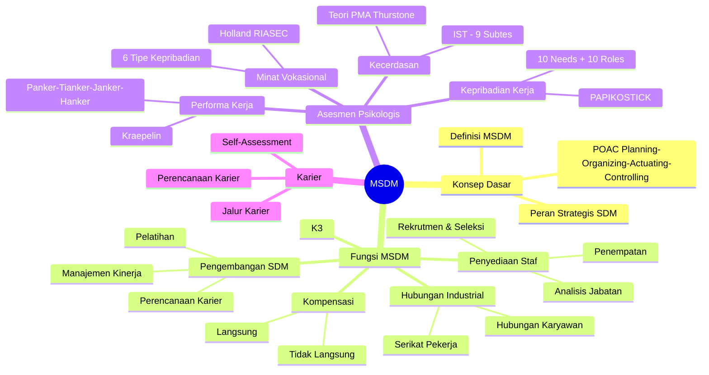

# Panduan Komprehensif UTS MSDM - Sesi 1 hingga 9

> **Catatan UTS:** Berdasarkan RPS, UTS merupakan elaborasi antara **teori MSDM** dengan **teori dasar IST, Kraepelin, Holland, dan PAPIKOSTICK**. Pahami keduanya secara terintegrasi, bukan terpisah.

---

## Mind Map

---

## SESI 1: Konsep Dasar Manajemen dan MSDM

### Prinsip Manajemen (POAC)

Manajemen adalah proses merencanakan, mengorganisasikan, menggerakkan, dan mengawasi sumber daya organisasi untuk mencapai tujuan secara efektif dan efisien.

| Fungsi | Penjelasan |
|---|---|
| **Planning** | Menetapkan tujuan dan merumuskan cara untuk mencapainya |
| **Organizing** | Mengatur struktur dan hubungan antar unit kerja; menetapkan tugas masing-masing unit. Tidak dapat diwujudkan tanpa hubungan dengan yang lain (George R. Terry) |
| **Actuating** | Menggerakkan atau melaksanakan apa yang telah direncanakan; mengarahkan anggota organisasi untuk bekerja |
| **Controlling** | Mengawasi pelaksanaan rencana; memastikan hasil sesuai standar yang telah ditetapkan |

### Definisi MSDM

MSDM adalah **pengakuan tentang pentingnya tenaga kerja organisasi** sebagai sumber daya yang sangat penting dalam memberi kontribusi bagi tujuan-tujuan organisasi, serta penggunaan berbagai fungsi dan kegiatan untuk memastikan SDM tersebut digunakan secara efektif dan adil bagi kepentingan individu, organisasi, dan masyarakat.

- **Mondy (2008):** MSDM adalah pemanfaatan sejumlah individu untuk mencapai tujuan organisasi.
- **Armstrong (2006):** MSDM adalah pendekatan strategis dan koheren dalam mengelola aset paling berharga organisasi, yaitu orang-orang yang bekerja di dalamnya.

### Peran Strategis MSDM

- MSDM modern berperan sebagai **mitra strategis** manajemen dalam mencapai tujuan organisasi, bukan sekadar mengurus administrasi (absensi, gaji).
- SDM membantu organisasi **beradaptasi** dengan perubahan global, teknologi, dan persaingan.
- Fungsi SDM terlibat langsung dalam **perencanaan bisnis** jangka panjang.

---

## SESI 2: Fungsi-Fungsi MSDM

MSDM memiliki enam fungsi utama yang saling berkaitan:

### 1. Penyediaan Staf (Staffing)

Proses menjamin organisasi selalu memiliki karyawan yang tepat, dengan keahlian memadai, di pekerjaan yang tepat, pada waktu yang tepat.

Ruang lingkup:
- **Analisis jabatan**: penentuan deskripsi dan kualifikasi pekerjaan secara sistematis
- **Perencanaan SDM**: mencocokkan pasokan internal dan eksternal dengan peluang pekerjaan
- **Rekrutmen**: menarik individu yang memenuhi kualifikasi untuk melamar
- **Seleksi**: memilih pelamar paling sesuai untuk posisi tertentu
- **Penempatan**: menempatkan individu pada pekerjaan sesuai kesesuaian individu-pekerjaan

### 2. Pengembangan SDM

Ruang lingkup:
- **Pelatihan**: kegiatan terencana untuk memfasilitasi belajar karyawan mencapai kompetensi (pengetahuan, keterampilan, perilaku)
- **Perencanaan dan pengembangan karier**: proses berkelanjutan menetapkan tujuan karier dan mengidentifikasi cara mencapainya
- **Pengembangan organisasi**
- **Manajemen kinerja dan penilaian kinerja**

### 3. Kompensasi

Mencakup semua imbalan total (langsung maupun tidak langsung) yang diberikan kepada karyawan sebagai timbal balik atas jasa yang diberikan.

### 4. Pengelolaan Relasi Industrial

Aktivitas MSDM yang terkait dengan hubungan antara organisasi dan karyawan, serta perwakilan kolektif mereka (serikat pekerja).

Dua aspek:
- **Hubungan karyawan**: kontrak kerja, promosi, penugasan, penghentian, pengunduran diri, disiplin, keluhan, komunikasi internal
- **Hubungan industrial**: negosiasi bersama (collective bargaining) dengan serikat pekerja

### 5. Keselamatan dan Kesehatan Kerja (K3)

- **Keselamatan**: perlindungan karyawan dari cedera akibat kecelakaan kerja
- **Kesehatan**: kebebasan karyawan dari penyakit fisik atau emosional
- Karyawan di lingkungan aman dan sehat lebih produktif dan memberikan manfaat jangka panjang bagi organisasi

### 6. Manajemen Kinerja dan Penilaian Kinerja

Proses mengevaluasi sejauh mana karyawan mencapai standar kinerja yang telah ditetapkan melalui analisis jabatan.

---

## SESI 3: Analisis Jabatan

### Definisi

Analisis jabatan adalah **proses sistematis** untuk menentukan keterampilan, tugas, dan pengetahuan yang dibutuhkan guna melakukan pekerjaan di suatu organisasi (Mondy, 2008). Ini adalah titik awal dan dasar untuk melanjutkan aktivitas SDM lainnya.

### Fungsi Analisis Jabatan dalam MSDM

| Fungsi MSDM | Peran Analisis Jabatan |
|---|---|
| Staffing | Menjelaskan kualifikasi yang dibutuhkan; dasar rekrutmen dan seleksi |
| Training & Development | Mengidentifikasi kesenjangan kemampuan karyawan vs tuntutan pekerjaan |
| Performance Appraisal | Menetapkan standar kinerja sebagai acuan evaluasi yang objektif |
| Compensation | Menentukan nilai relatif pekerjaan sebagai dasar penetapan kompensasi |
| Legal Considerations | Deskripsi jabatan objektif mencegah persyaratan yang diskriminatif |
| Safety & Health | Mengidentifikasi risiko yang melekat pada pekerjaan |
| Employee & Labor Relations | Pedoman dalam promosi, mutasi, penghentian, dan penurunan jabatan |

### Teknik Analisis Jabatan (Mondy & Martocchio, 2016)

Analisis jabatan menitikberatkan pada tiga hal:

1. **Analisis Aktivitas Kerja (Work Activities):** mengkaji tugas, tanggung jawab, dan aktivitas aktual yang dilakukan. Berdasarkan kondisi nyata di lapangan, bukan gambaran ideal.

2. **Analisis Aktivitas Berorientasi Pekerja (Worker-Oriented Activities):** menitikberatkan pada karakteristik individu yang dibutuhkan: pengetahuan, keterampilan, kemampuan, tuntutan kognitif dan interpersonal.

3. **Analisis Mesin, Peralatan, dan Fasilitas Kerja:** mengkaji sarana dan teknologi yang digunakan; penting untuk K3, kebutuhan pelatihan, dan efisiensi kerja.

### Metode Pengumpulan Data

| Metode | Kelebihan | Kelemahan |
|---|---|---|
| **Kuesioner** | Efisien, ekonomis | Bisa tidak akurat; responden bisa membesar-besarkan tugas |
| **Observasi** | Efektif untuk pekerjaan fisik/manual | Kurang tepat untuk pekerjaan kognitif |
| **Wawancara** | Pemahaman mendalam; memungkinkan klarifikasi | Memakan waktu |
| **Employee Recording** | Baik untuk pekerjaan kompleks/khusus | Berpotensi subjektif |
| **Metode Kombinasi** | Paling komprehensif dan akurat | - |

### Sumber Data

- **Pemegang jabatan**: paling tahu kondisi nyata pekerjaan; risiko membesar-besarkan tugas
- **Supervisor**: pandangan struktural-manajerial; mungkin tidak tahu detail teknis kecil
- **HR Analyst**: observasi objektif; tidak cukup sendiri untuk pekerjaan kognitif
- **Dokumen Internal**: SOP, deskripsi jabatan lama; bersifat statis
- **Sumber Eksternal (O\*NET & SOC)**: terstandarisasi nasional; terlalu umum untuk kebutuhan spesifik perusahaan

### Unit Analisis Jabatan

Unit analisis adalah **jabatan itu sendiri**, bukan individu. Yang dianalisis:
1. Tugas dan aktivitas kerja (apa, bagaimana, seberapa sering)
2. Tanggung jawab (akuntabilitas terhadap hasil)
3. Standar kinerja (indikator keberhasilan)
4. Persyaratan kompetensi (KSA: Knowledge, Skills, Abilities)
5. Wewenang (hak pengambilan keputusan)

### Output Analisis Jabatan

- **Job Description:** dokumen yang menjelaskan tugas, tanggung jawab, dan kewajiban utama pemegang jabatan. Mencegah tumpang tindih tugas; menjadi pedoman rekrutmen, penilaian kinerja, dan pelatihan.
- **Job Specification:** dokumen persyaratan minimum yang harus dimiliki individu agar mampu melaksanakan jabatan secara efektif. Mencantumkan keahlian dan kualifikasi minimum.

---

## SESI 4: Rekrutmen, Seleksi, dan Penempatan

### Rekrutmen

**Definisi:** Proses menarik individu pada waktu tertentu, dalam jumlah cukup, dan dengan kualifikasi yang memadai untuk melamar pekerjaan dalam organisasi (Mondy & Martocchio, 2016).

#### Strategi Rekrutmen

| Komponen | Penjelasan |
|---|---|
| **Where to Look** | Pasar tenaga kerja yang menjadi sumber kandidat (internal vs. eksternal) |
| **Entry Positions** | Kebijakan dari mana karyawan baru umumnya direkrut |
| **Attracting Candidates** | Citra organisasi, kompensasi kompetitif, peluang karier |
| **Realistic Job Preview (RJP)** | Memberikan informasi akurat (positif DAN negatif) tentang pekerjaan untuk mengurangi kesenjangan ekspektasi dan mencegah turnover dini |

#### Sumber Rekrutmen

**Internal:**
- **Job Posting**: pengumuman lowongan kepada seluruh karyawan
- **Departing Employees**: karyawan yang keluar atas kemauannya sendiri dapat direkrut kembali

Keunggulan: biaya lebih rendah, moral karyawan naik, kandidat sudah paham budaya organisasi.

**Eksternal:**
- Walk-ins, rekomendasi karyawan, iklan, agen ketenagakerjaan, kampus (campus recruiting), head hunter/executive search

### Seleksi

**Definisi:** Proses memilih pelamar yang paling sesuai untuk posisi tertentu dan organisasi.

#### Selection Ratio (SR)

$$SR = \frac{\text{Jumlah yang Diterima}}{\text{Jumlah Total Pelamar}}$$

- SR mendekati **0,10**: seleksi sangat ketat dan selektif
- SR sekitar **0,30**: seleksi moderat
- SR mendekati **0,80**: hampir semua pelamar diterima; kurang selektif

SR yang rendah mengindikasikan standar tinggi dan rekrutmen yang berhasil.

#### Yield Ratio (YR)

Mengukur efektivitas setiap tahap proses rekrutmen-seleksi:

$$YR_{\text{per tahap}} = \frac{\text{Jumlah yang Lolos Tahap}}{\text{Jumlah Kandidat Tahap Sebelumnya}}$$

$$SR = YR_1 \times YR_2 \times YR_3 \times \ldots$$

Yield ratio membantu mengidentifikasi tahap mana yang menjadi **bottleneck**.

#### Proses Penyaringan (Screening)

Menyaring pelamar yang tidak memenuhi persyaratan dasar melalui: review CV, wawancara awal, tes psikologis awal, pemeriksaan referensi.

#### Alat Seleksi

| Alat | Contoh |
|---|---|
| Tes kemampuan kognitif | IST |
| Tes kepribadian | PAPIKOSTICK, EPPS |
| Tes minat dan bakat | Holland/RIASEC |
| Wawancara seleksi | Terstruktur/semi-terstruktur |
| Assessment center | Simulasi situasi kerja nyata |

### Penempatan

Penempatan adalah prosedur untuk menentukan posisi kerja bagi individu berdasarkan **kesesuaian individu-pekerjaan (person-job fit)**. Dasar penempatan yang baik mempertimbangkan hasil asesmen psikologis, job description & job specification, kebutuhan organisasi, dan potensi karier individu.

---

## SESI 5: IST (Intelligenz-Struktur-Test) dan Teori PMA

### Latar Belakang: Teori Primary Mental Abilities (Thurstone)

**L.L. Thurstone** mengkritik teori faktor umum ("g") Spearman yang menyatakan kecerdasan bersifat tunggal. Thurstone berargumen bahwa kecerdasan terdiri dari **7 kemampuan dasar yang relatif independen**, yang diidentifikasi melalui **Exploratory Factor Analysis (EFA)**.

#### 7 Kemampuan Dasar PMA

| Kode | Kemampuan | Deskripsi |
|---|---|---|
| **V** | Verbal Comprehension | Memahami makna kata dan bahasa; membaca dengan pemahaman |
| **W** | Word Fluency | Menghasilkan kata secara cepat berdasarkan kriteria tertentu |
| **N** | Number | Operasi numerik cepat dan akurat (aritmatika dasar) |
| **S** | Space | Memvisualisasikan dan memanipulasi objek dalam ruang 3D secara mental |
| **M** | Associative Memory | Mengingat dan mengasosiasikan pasangan informasi tanpa hubungan logis |
| **P** | Perceptual Speed | Mengenali persamaan/perbedaan objek visual secara cepat dan akurat |
| **I** | General Reasoning | Menemukan pola dan prinsip dalam informasi; penalaran induktif |

**Kontribusi utama PMA:** pergeseran dari skor IQ tunggal menuju **profil kemampuan** yang lebih informatif dan relevan untuk pencocokan jabatan.

### IST: Intelligenz-Struktur-Test

Dikembangkan oleh **Rudolf Amthauer** di Jerman (1953). Mengukur kecerdasan multidimensional. Di Indonesia, IST adalah alat ukur kecerdasan paling banyak digunakan dalam psikologi industri dan organisasi untuk seleksi dan penempatan.

#### 9 Subtes IST dan Pemetaan ke PMA

| Subtes | Kode | Deskripsi | Kemampuan PMA |
|---|---|---|---|
| Satzergänzung | SE | Melengkapi kalimat; berpikir verbal praktis | V |
| Wortauswahl | WA | Pilihan kata; membedakan konsep dan kategori | V |
| Analogien | AN | Analogi kata; penalaran relasional verbal | V + I |
| Gemeinsamkeiten | GE | Kesamaan konsep; abstraksi verbal | I |
| Merkaufgaben | ME | Tugas memori; memori asosiatif jangka pendek | M |
| Rechenaufgaben | RA | Soal berhitung; kemampuan numerik dasar | N |
| Zahlenreihen | ZR | Deret angka; deteksi pola numerik + penalaran induktif | N + I |
| Figurenauswahl | FA | Pemilihan gambar; imajinasi spasial 2D | S |
| Würfelaufgaben | WÜ | Tugas kubus; berpikir spasial 3D, rotasi mental | S |

#### Administrasi IST

- Dapat disajikan **individual maupun klasikal**
- Total waktu: sekitar **72 menit** (dibagi per subtes)
- IST termasuk **timed power test**: batas waktu bersifat administratif, bukan untuk mengukur kecepatan semata
- Setiap subtes memiliki kunci jawaban dan pedoman penskoran tersendiri
- Hasil: bukan hanya IQ total, tetapi **profil skor per subtes** yang memperlihatkan konfigurasi kekuatan dan kelemahan kognitif

#### Informed Consent dalam Administrasi Tes

Testee menandatangani informed consent yang berisi:
- Kesediaan mengikuti psikotes
- Kesediaan tidak menerima hasil pemeriksaan psikologi
- Hasil analisis jabatan masih dapat diberikan ke organisasi

#### Implikasi IST dalam MSDM

- **Seleksi**: profil IST memungkinkan pencocokan presisi antara kemampuan kognitif pelamar dengan tuntutan jabatan (contoh: akuntan butuh N dan P kuat; desainer butuh S kuat)
- **Penempatan**: profil kognitif memandu keputusan penempatan
- **Pelatihan**: kemampuan lemah menjadi dasar perancangan program pelatihan
- **Konseling karier**: profil digunakan sebagai bahan diskusi perencanaan karier

---

## SESI 6: Tes Kraepelin dan Administrasi Tes Psikologi

### Tes Kraepelin Versi UI

Dikembangkan oleh **Emil Kraepelin**, psikiater Jerman abad ke-19, untuk mempelajari pengaruh kelelahan dan kondisi psikologis terhadap efisiensi kerja. Di Indonesia diadaptasi oleh Universitas Indonesia.

**Landasan Teoritis:** Kraepelin mengukur **kinerja tipikal (typical performance)** dalam kondisi kerja berulang dan monoton. Berbeda dari IST yang mengukur kemampuan maksimal (maximum performance).

#### Format dan Prosedur

- Lembaran berisi kolom-kolom angka satu digit acak
- Testee menjumlahkan dua angka berdekatan dari bawah ke atas
- Hanya **digit terakhir** hasil penjumlahan yang dituliskan
- Per kolom ada batas waktu (aba-aba tester); total 50 kolom, 15 detik per kolom
- Total waktu: sekitar **20 menit**

#### 4 Aspek yang Diukur (PTJH)

| Nama Resmi | Singkatan | Penjelasan |
|---|---|---|
| Kecepatan Kerja (Tempo) | **Panker** | Jumlah total item yang diselesaikan per satuan waktu |
| Ketelitian Kerja (Akurasi) | **Tianker** | Jumlah kesalahan penjumlahan |
| Keajegan Kerja | **Janker** | Konsistensi/stabilitas kecepatan dan akurasi antar kolom |
| Ketahanan Kerja | **Hanker** | Kemampuan mempertahankan performa meski timbul kelelahan |

#### Penskoran

Penskoran dilakukan dengan menghitung jumlah jawaban benar dan menganalisis **pola kerja melalui grafik** hasil tes (bukan hanya jumlah benar).

#### Relevansi dalam MSDM

Cocok untuk seleksi jabatan yang menuntut:
- Konsentrasi tinggi dalam jangka panjang
- Ketelitian dalam pekerjaan berulang
- Ketahanan terhadap kelelahan dan tekanan
- Konsistensi kerja di bawah kondisi monoton

Contoh jabatan: operator data entry, kasir, pengolah data keuangan, pekerjaan produksi presisi.

---

### Modul Administrasi Tes Psikologi

#### Psikodiagnostik

Proses pemeriksaan psikologis sistematis menggunakan metode dan instrumen ilmiah untuk mengidentifikasi karakteristik psikologis individu (Jager & Petermann). Dalam MSDM, berfokus pada 19 aspek psikologis yang relevan dengan kinerja kerja.

#### 3 Prinsip Dasar Pemeriksaan Psikologi

1. **Rapport**: hubungan kerja positif, hangat, dan kondusif antara pemeriksa dan OP. Menciptakan kondisi psikologis optimal agar OP menampilkan kemampuan terbaiknya.
2. **Ego Involvement**: OP memahami pentingnya tes dan merasa hasil relevan dengan kepentingannya, sehingga menampilkan performa sesungguhnya.
3. **Motivation**: motivasi internal OP untuk mengerjakan tes secara optimal; pemeriksa bertugas membangun dan mempertahankannya.

#### 3 Fase Pemeriksaan

1. **Fase Persiapan**: penyiapan ruangan, instrumen, bahan tes; pemeriksaan kondisi fisik ruang; persiapan mental OP
2. **Fase Pengetesan**: pelaksanaan sesuai prosedur baku, pemberian instruksi, pengawasan waktu
3. **Fase Penutup**: pengumpulan lembar jawaban, penskoran, verifikasi kelengkapan data

#### Jenis-Jenis Tes Psikologi

| Jenis | Penjelasan | Contoh |
|---|---|---|
| **Speed Test** | Waktu sangat terbatas; soal mudah; skor dari jumlah jawaban benar | Kraepelin |
| **Power Test** | Soal sukar; tidak dibatasi waktu ketat; skor dari keberhasilan menjawab | IST (timed power test) |
| **Tes Individual** | Satu orang; gambaran lebih detail | - |
| **Tes Klasikal** | Kelompok; efisien; umum di PIO | IST, Kraepelin |
| **Tes Proyektif** | Stimuli ambigu; mengukur motif implisit/dinamika bawah sadar | Rorschach, TAT |
| **Tes Inventori** | Self-report; terstruktur; mengukur motif yang diatribusikan sendiri | PAPIKOSTICK, EPPS |

#### Skill Tester

Tester yang kompeten harus memiliki:
1. **Process Skill**: keterampilan mengadministrasikan dan menjalin relasi dengan subjek
2. **Content Skill**: keterampilan mengkaji aspek kepribadian yang diukur; tidak boleh single sign approach
3. **Cognitive Skill**: kemampuan mengolah, menganalisis, mengintegrasikan hasil menjadi gambaran kepribadian yang utuh

---

## SESI 7: Perencanaan dan Pengembangan Karier

### Konsep Karier

Karier adalah jalur umum yang ditempuh seseorang sepanjang kehidupan kerjanya (Mondy & Martocchio, 2016).

| Konsep Lama | Konsep Baru |
|---|---|
| Statis, linear, ditentukan organisasi | Fleksibel, dinamis, dikelola aktif oleh individu |
| Mengikuti jalur hierarkis | Individu bertanggung jawab atas perkembangan karier sendiri |

### Jalur Karier

| Jalur | Penjelasan |
|---|---|
| **Traditional Career Path** | Vertikal dan linier; naik jabatan secara bertahap dalam hirarki |
| **Network Career Path** | Menggabungkan pergerakan vertikal dan horizontal (lintas unit/fungsi) |
| **Alternative Career Path** | Di luar jalur hierarkis; paruh waktu, berbasis proyek |
| **Lateral Skill Path** | Perpindahan lateral (setara jabatan) untuk memperluas keterampilan |
| **Dual-Career Path** | Profesional teknis berkembang paralel dengan jalur manajerial |
| **Demotion** | Penurunan jabatan; kadang dipilih sukarela untuk keseimbangan hidup |
| **Free Agents** | Tidak terikat satu organisasi; menawarkan keahlian spesifik secara fleksibel |

### Perencanaan Karier (Individu)

Proses berkelanjutan menetapkan tujuan karier dan mengidentifikasi cara mencapainya. Lima tahap:

1. **Penilaian diri (self-assessment)**: memahami kekuatan, kelemahan, minat, dan nilai pribadi
2. **Eksplorasi karier**: mengidentifikasi berbagai pilihan karier yang sesuai
3. **Penetapan tujuan karier**: sasaran jangka pendek dan jangka panjang yang realistis
4. **Perencanaan tindakan**: langkah-langkah konkret untuk mencapai tujuan
5. **Evaluasi dan penyesuaian**: evaluasi periodik dan penyesuaian rencana

#### Alat Bantu Self-Assessment

- **Strength/Weakness Balance Sheet**: analisis tertulis kekuatan dan kelemahan diri
- **Likes/Dislikes Survey**: daftar hal yang disukai/tidak disukai dalam pekerjaan untuk mengidentifikasi lingkungan kerja yang sesuai

### Pengembangan Karier (Organisasi)

Pendekatan formal organisasi untuk memastikan tersedianya individu berkualifikasi ketika dibutuhkan. Organisasi berperan aktif melalui: program pelatihan, mentoring, jalur karier yang transparan, dan rotasi jabatan.

**Prinsip kunci:** karier individu dan kebutuhan organisasi tidak dapat dipisahkan. Organisasi yang mendukung pengembangan karier mendapatkan karyawan yang lebih loyal, termotivasi, dan produktif.

### Keterkaitan dengan Fungsi MSDM Lainnya

- Analisis Jabatan: informasi jalur karier dan persyaratan tiap posisi
- Rekrutmen & Seleksi: individu dengan perencanaan karier yang jelas lebih selektif memilih organisasi
- Penilaian Kinerja: input penting bagi perencanaan karier
- Kompensasi: struktur kompensasi yang mencerminkan jalur karier meningkatkan motivasi
- Asesmen Psikologis (Holland/RIASEC): mengidentifikasi jalur karier sesuai karakteristik individu

---

## SESI 8: Holland's Theory of Career Choice dan RIASEC

### Konsep Dasar

Teori Holland menghubungkan **tipe kepribadian individu** dengan **lingkungan karier yang sesuai**. Dua premis utama:

1. **Orang mencari lingkungan yang selaras dengan kepribadiannya**: individu memilih lingkungan kerja yang memungkinkan ekspresi keterampilan, nilai, dan peran yang menyenangkan.
2. **Perilaku ditentukan oleh interaksi kepribadian dan lingkungan**: pilihan pekerjaan, pencapaian, dan kepuasan dapat diprediksi dari pasangan kepribadian-lingkungan.

### Enam Tipe Kepribadian RIASEC

| Kode | Tipe | Karakteristik | Lingkungan Kerja | Contoh Pekerjaan |
|---|---|---|---|---|
| **R** | Realistic | Praktis, menyukai aktivitas fisik, keterampilan mekanik/atletik, konservatif | Aktivitas fisik, alat/mesin, luar ruangan | Pertanian, konstruksi, teknisi |
| **I** | Investigative | Analitis, intelektual, suka memecahkan masalah, mandiri, skeptis | Penelitian, analisis, pemecahan masalah | Ilmu pengetahuan, teknologi, akademisi |
| **A** | Artistic | Kreatif, imajinatif, ekspresif, tidak konvensional, terbuka pengalaman baru | Kebebasan berekspresi dan berkreasi | Seni, desain, musik, penulisan |
| **S** | Social | Ramah, empatik, suka membantu, kooperatif, keterampilan interpersonal baik | Interaksi dengan orang lain, pelayanan | Pendidikan, kesehatan, konseling |
| **E** | Enterprising | Ambisius, persuasif, berorientasi tujuan, kepemimpinan kuat | Memimpin, menjual, mengelola | Bisnis, penjualan, manajemen |
| **C** | Conventional | Terorganisir, detail-oriented, menyukai struktur dan data | Struktur, rutinitas, pekerjaan terorganisir | Administrasi, akuntansi, keuangan |

### Model Heksagonal

Tipe-tipe RIASEC direpresentasikan dalam heksagon. Posisi pada heksagon mencerminkan kemiripan dan perbedaan:

- **Adjacent (berdekatan):** paling kompatibel: R-C, C-E, E-S, S-A, A-I, I-R
- **Opposite (berlawanan):** paling tidak konsisten: R vs S, I vs E, A vs C

### Konsep Interpretasi

| Konsep | Penjelasan |
|---|---|
| **Holland Code** | Kombinasi 3 huruf tipe paling dominan (contoh: SEC); tiga skor tertinggi |
| **Diferensiasi** | Terdiferensiasi: minat kuat di 1-2 bidang. Tidak terdiferensiasi: merata di banyak bidang |
| **Kongruensi** | Kesesuaian tipe kepribadian dengan lingkungan pekerjaan; kongruensi tinggi = kepuasan & kinerja lebih baik |
| **Konsistensi** | Tipe berdekatan pada heksagon = konsisten; tipe berlawanan = tidak konsisten |

### Administrasi RIASEC

- Format: kuesioner forced-choice (mencentang pernyataan yang mencerminkan diri)
- Berbeda dari tes lain: peserta **dapat mencentang lebih dari satu pernyataan** per kolom
- Skoring: akumulasi pilihan per tipe; 3 tipe dengan skor tertinggi = Holland Code
- Dapat individual maupun kelompok

### Implikasi dalam MSDM

- **Seleksi**: mencocokkan profil minat kandidat dengan karakteristik lingkungan jabatan
- **Penempatan**: memastikan kesesuaian antara tipe kepribadian dan lingkungan kerja
- **Pengembangan karier**: membantu karyawan mengidentifikasi jalur karier sesuai RIASEC
- **Manajemen tim**: memahami komposisi tipe kepribadian untuk menciptakan lingkungan kerja yang mendukung

---

## SESI 9: PAPIKOSTICK

### Latar Belakang

**PAPIKOSTICK** (Personality and Preference Inventory - Kostick) dikembangkan oleh **Max Martin Kostick** dari Boston State College pada awal 1960-an. Masuk ke Indonesia sekitar tahun 1980. Alat ukur paling banyak digunakan dalam psikologi industri dan organisasi Indonesia untuk seleksi, penempatan, dan pengembangan karyawan.

### Landasan Teoritis: Personologi Henry Murray

PAPIKOSTICK berbasis teori personologi **Henry Murray**, yang memandang kepribadian sebagai sistem interaksi antara:
- **Needs**: dorongan internal yang memotivasi perilaku
- **Press**: kondisi eksternal lingkungan yang mempengaruhi perilaku

PAPIKOSTICK mengukur needs dan roles yang bersifat **work-related**: bagaimana individu berperilaku dan mengambil keputusan dalam lingkungan kerja. Bukan alat ukur kepribadian komprehensif.

### Struktur: 20 Skala (10 Needs + 10 Roles)

#### 10 Needs (Kebutuhan)

| Kode | Nama | Deskripsi |
|---|---|---|
| **P** | Need to Control Others | Kebutuhan mengontrol, mempengaruhi, atau mendominasi orang lain |
| **W** | Need for Rules and Supervision | Kebutuhan bekerja di bawah aturan jelas dan pengawasan terstruktur |
| **Z** | Need for Change | Kebutuhan variasi, perubahan, dan hal-hal baru |
| **N** | Need to Finish a Task | Kebutuhan menyelesaikan pekerjaan hingga tuntas sebelum beralih |
| **X** | Need to Be Noticed | Kebutuhan mendapat perhatian dan pengakuan |
| **B** | Need to Belong to Groups | Kebutuhan menjadi bagian kelompok dan bekerja dalam tim |
| **O** | Need to Be Close and Affectionate | Kebutuhan membangun hubungan dekat dan afektif |
| **K** | Need to Be Forceful | Kebutuhan bertindak tegas dan langsung dalam menyelesaikan masalah |
| **A** | Need to Achieve | Kebutuhan berprestasi dan melampaui standar |
| **F** | Need to Support Authority | Kebutuhan mendukung dan mengikuti otoritas |

#### 10 Roles (Peran)

| Kode | Nama | Deskripsi |
|---|---|---|
| **L** | Leadership Role | Kecenderungan mengambil peran kepemimpinan |
| **C** | Organized Type | Bekerja secara terorganisir, terstruktur, dan sistematis |
| **D** | Detail-Conscious Type | Perhatian tinggi terhadap detail, ketelitian, dan akurasi |
| **R** | Conceptual Thinker | Berpikir secara konseptual, reflektif, dan analitis |
| **S** | Social Harmonizer | Menjaga harmoni sosial dan menghindari konflik |
| **I** | Easy-Going Type | Kemudahan pengambilan keputusan; gaya kerja tidak kaku |
| **T** | Work Pace Setter | Bekerja dengan kecepatan dan ritme yang konsisten |
| **V** | Vigorous Type | Orientasi pada aktivitas fisik, energik, dan dinamis |
| **E** | Emotionally Restrained Type | Mengendalikan emosi dan tampil tenang dalam situasi kerja |
| **G** | Hard-Working Type | Bekerja keras, tekun, dan berdedikasi tinggi |

#### 7 Aspek Utama (Pengelompokan dari RPS)

| Aspek | Skala yang Termasuk |
|---|---|
| **Followership** | F (Support Authority), W (Rules & Supervision) |
| **Work Direction** | N (Finish Task), G (Hard Worker), A (Achieve) |
| **Leadership** | L (Leadership), P (Control Others), I (Decision Making) |
| **Activity** | T (Work Pace), V (Vigorous) |
| **Social Nature** | X (Be Noticed), S (Social Harmonizer), B (Belong to Groups), O (Close/Affectionate) |
| **Workstyle** | R (Conceptual), D (Detail), C (Organized) |
| **Temperament** | Z (Change), E (Emotional Restraint), K (Forceful) |

### Administrasi dan Skoring

- Format: **forced-choice** (pilih satu dari dua pernyataan yang paling menggambarkan diri)
- Total: **90 pasang pernyataan** (45 atas + 45 bawah)
- Durasi: **25-35 menit**
- Skor setiap skala: 0-9; rentang rendah (0-3), sedang (4-5), tinggi (6-9)
- Total keseluruhan: 45

### Pendekatan Interpretasi

| Analisis | Penjelasan |
|---|---|
| **Middle Range Analysis** | Skor 4-5: tingkat cukup |
| **Extreme Analysis** | Skor tinggi (6-9) atau rendah (0-3): kecenderungan kuat/lemah |
| **Adjacent Analysis** | Membandingkan skala-skala yang berkaitan |
| **Opposite Analysis** | Membandingkan skala-skala yang berlawanan |
| **Linkage Analysis** | Menganalisis keterkaitan antar skala |
| **Vector Analysis** | Analisis arah dan kekuatan pola profil secara keseluruhan |

### Kegunaan dalam MSDM

- **Seleksi**: mencocokkan profil needs dan roles kandidat dengan tuntutan jabatan
- **Penempatan**: kesesuaian perilaku kerja individu dengan lingkungan dan posisi
- **Pengembangan karier**: mengidentifikasi jalur karier sesuai kebutuhan dan peran dominan
- **Pengembangan tim**: memahami komposisi kebutuhan dan peran dalam tim
- **Pelatihan**: merancang program sesuai profil kebutuhan dan gaya kerja

### Keterbatasan

- Rentan terhadap **social desirability bias**: subjek dapat memanipulasi jawaban agar terlihat lebih positif
- Kurang komprehensif untuk tujuan asesmen klinis
- Interpretasi harus kontekstual sesuai jabatan spesifik dan dikombinasikan dengan alat lain

---

## Ringkasan: Integrasi MSDM dan Asesmen (Kunci UTS)

Berdasarkan RPS, UTS menguji **elaborasi antara teori MSDM dan teori dasar alat tes**. Berikut integrasinya:

| Fungsi MSDM | IST | Kraepelin | Holland/RIASEC | PAPIKOSTICK |
|---|---|---|---|---|
| **Rekrutmen & Seleksi** | Mengukur profil kognitif pelamar; mencocokkan dengan tuntutan jabatan | Menyeleksi jabatan yang butuh konsentrasi tinggi dan kerja berulang | Mencocokkan tipe minat dengan lingkungan kerja | Mencocokkan needs/roles dengan tuntutan jabatan |
| **Penempatan** | Profil subtes menunjukkan kemampuan spesifik sesuai jabatan | Mengidentifikasi individu cocok untuk pekerjaan monoton-presisi | Kongruensi tipe-lingkungan prediksi kepuasan kerja | Kesesuaian perilaku kerja dengan posisi |
| **Pengembangan Karier** | Profil PMA memandu konseling karier | Relevan untuk perencanaan beban kerja | Holland Code sebagai dasar rekomendasi karier | Profil needs dan roles sebagai arah pengembangan |
| **Analisis Jabatan** | Tuntutan jabatan kognitif diturunkan dari job spec | Pekerjaan membutuhkan kinerja tipikal berkelanjutan | Job environment = tipe lingkungan RIASEC | Job requirements = profil needs/roles ideal |

### Poin Kritis untuk Diingat

1. **IST** mengukur kemampuan **maksimal** (maximum performance); **Kraepelin** mengukur kinerja **tipikal** (typical performance) - keduanya berbeda jenis pengukuran.
2. **PAPIKOSTICK** bukan alat ukur kepribadian komprehensif; hanya mengukur perilaku dalam **konteks kerja**.
3. **Holland Code** = 3 tipe dominan. Kongruensi tinggi antara tipe individu dan lingkungan = kepuasan dan kinerja lebih baik.
4. Tidak ada single sign approach: setiap angka hanya hipotesis yang harus diverifikasi dengan alat lain.
5. **Analisis jabatan** adalah fondasi seluruh fungsi MSDM: rekrutmen, seleksi, penempatan, pelatihan, penilaian kinerja, dan kompensasi semuanya bertumpu pada job description dan job specification.
6. **Selection ratio rendah** (mendekati 0) = proses seleksi ketat = banyak pelamar sedikit yang diterima = standar tinggi.

---

*Sumber: RPS MSDM UM (Ninik Setiyowati dkk.), Mondy & Martocchio (2016), Mondy (2008), catatan kuliah sesi 2-9.*
