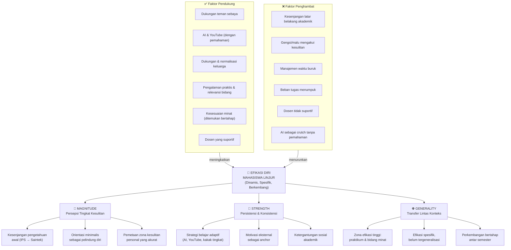
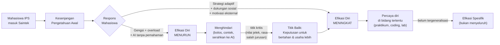

# Peta Konsep Efikasi Diri Mahasiswa Linjur

**Sumber data:** Wawancara mendalam S1, S2, S3 + significant other (SO)
**Kerangka:** Bandura (1997) - tiga dimensi efikasi diri

---

## Peta Konsep

---

## Ringkasan Dinamika

---

## Temuan Utama per Subjek

| Dimensi | S1 (Faiz - TRSE) | S2 (Rozit - Tek. Lingkungan) | S3 (Jessie - Instrumentasi) |
|---------|-----------------|------------------------------|------------------------------|
| **Magnitude** | Kesulitan: fisika, coding | Kesulitan: Matematika 1-2, unit operasi | Kesulitan: Elektronika Dasar |
| **Strength** | YouTube + nanya teman; prinsip minimal ekspektasi | Nilai C → memilih ulang; motivasi: jerih payah ortu | AI untuk memahami logika; belajar mandiri di kos |
| **Generality** | Percaya diri di praktikum; laporan jadi andalan | Percaya diri di lab lingkungan | Percaya diri di coding/Pemrograman Terstruktur |
| **Faktor Pendukung** | Teman sekelas, YouTube, IoT = koneksi ke minat awal | Lab experience, teman belajar | Latar keluarga saintek, orang tua normalisasi |
| **Faktor Penghambat** | Kadang gengsi nanya, beban fisika | Gaya dosen tertentu, beban semester 3 | Manajemen waktu buruk (smt 2), gengsi tanya dosen |
| **Titik Kritis** | Rasa salah jurusan (smt 1) | Nilai C Unit Operasi (smt 3) | Mempertimbangkan SNBT ulang (smt 2) |

---

## Catatan Analitis

**Pola yang muncul di semua subjek:**
1. Efikasi diri tidak terbentuk sejak awal masuk, tetapi **dibangun melalui pengalaman bertahan**.
2. Zona aman (lab, coding, praktikum) menjadi **titik awal generalisasi** yang belum selesai.
3. Faktor sosial (teman, keluarga) lebih dominan dari faktor institusional dalam membentuk efikasi.
4. Penggunaan AI bersifat ambivalen: bisa menjadi pendukung atau penghambat tergantung pada cara penggunaannya.

**Implikasi untuk gambaran efikasi diri mahasiswa linjur:**
Efikasi diri mahasiswa linjur IPS-Saintek adalah efikasi yang **sedang dalam proses pembentukan**, bukan efikasi yang mapan. Mahasiswa bergerak dari efikasi yang rendah dan spesifik pada bidang yang dipaksakan, menuju efikasi yang lebih kuat pada bidang yang ditemukan cocok. Proses ini membutuhkan waktu lebih dari satu atau dua semester.
